<div align="center">

# Jeevesh Singale

### **AI Engineer | Voice AI Systems & Agentic Orchestration**
*Building Low-Latency Voice Agents, Enterprise RAG Platforms, & Safe Agentic DAGs.*

London, UK &nbsp;•&nbsp; [LinkedIn](https://linkedin.com/in/jeevesh-singale07) &nbsp;•&nbsp; [Portfolio](https://jeevesh-portfolio-website-00.vercel.app/) &nbsp;•&nbsp; [Email](mailto:jeevesh2515@gmail.com)

<br/>

[](https://github.com/jeevesh2515)
[](https://github.com/jeevesh2515)
[](https://github.com/jeevesh2515)
[](https://opensource.org/licenses/MIT)

</div>

---

## 🎙️ Flagship Agentic Architectures

<table width="100%">
  <tr>
    <td width="50%" valign="top">
      <h3>⚡ <a href="https://github.com/jeevesh2515/voxflow-voice-agent">VoxFlow Voice Agent</a></h3>
      <p><b>Bilingual (Hindi/EN) Voice AI Agent for FMCG Operations.</b></p>
      <ul>
        <li><b>Turn Latency:</b> Engineered for &lt;200ms turn-taking (Connect → Groq Whisper → Llama 3 → Edge TTS)</li>
        <li><b>Streaming:</b> Raw PCM WebSockets + Silero VAD + Edge TTS</li>
        <li><b>Stateful Tools:</b> Live stock validation & dynamic PO dispatch with LangGraph</li>
      </ul>
      <p>
        
        
        
      </p>
    </td>
    <td width="50%" valign="top">
      <h3>🏥 <a href="https://github.com/jeevesh2515/clinical-rag-agent">Clinical RAG Workflows</a></h3>
      <p><b>Evidence-based clinical assistant for chronic hypertension care.</b></p>
      <ul>
        <li><b>Zero-Hallucination Spine:</b> Knowledge stored as a Google OKF bundle for deterministic RAG</li>
        <li><b>Safety Guardrails:</b> Edge-level deterministic refusal & clinical calculators (eGFR, MAP)</li>
        <li><b>Evaluation:</b> 258 passing tests + LangSmith benchmark suite</li>
      </ul>
      <p>
        
        
        
      </p>
    </td>
  </tr>
  <tr>
    <td width="50%" valign="top">
      <h3>🔍 <a href="https://github.com/jeevesh2515/expertiq-copilot">ExpertIQ Copilot</a></h3>
      <p><b>Enterprise research intelligence & expert discovery platform.</b></p>
      <ul>
        <li><b>Hybrid RAG:</b> 6-node LangGraph pipeline over ChromaDB + NetworkX with HyDE</li>
        <li><b>Interactive UI:</b> Next.js 16 + React 19 + 3D force-directed D3 graph UI</li>
        <li><b>Verification:</b> 47 automated tests, Redis cache, and Docker deploy</li>
      </ul>
      <p>
        
        
        
      </p>
    </td>
    <td width="50%" valign="top">
      <h3>🛡️ <a href="https://github.com/jeevesh2515/readme-guardian">Readme Guardian</a></h3>
      <p><b>Documentation freshness & drift verification engine for AI repos.</b></p>
      <ul>
        <li><b>Distribution:</b> Packaged via custom Homebrew Tap (<code>brew install</code>)</li>
        <li><b>Automation:</b> Pre-commit hooks & CI drift verification</li>
        <li><b>Test Suite:</b> 15 passing pytest unit tests (100%) + Ruff compliance</li>
      </ul>
      <p>
        
        
        
      </p>
    </td>
  </tr>
</table>

---

## 🛠️ Technical Stack & AI Capabilities

```
Core AI & Agents   : LangGraph, LlamaIndex, Semantic Kernel, CrewAI, AutoGen
Audio & Realtime   : Silero VAD, Whisper ASR, Deepgram, ElevenLabs, WebSockets, WebRTC
RAG & Knowledge    : Hybrid (Dense + BM25), GraphRAG, LanceDB, ChromaDB, pgvector, NetworkX
Backend & Cloud    : Python 3.11+, FastAPI, Node.js/TypeScript, Docker, Redis, PostgreSQL
Frontend & UI      : Next.js 14, React 19, TailwindCSS v4, Vite, Web Audio Worklets
Safety & Evals     : LangSmith, Ragas, DeepEval, Deterministic Guardrails
```

---

## 📈 Activity & Contribution Velocity

<table width="100%">
  <tr>
    <td width="50%" align="center" valign="top">
      
    </td>
    <td width="50%" align="center" valign="top">
      
    </td>
  </tr>
  <tr>
    <td colspan="2" width="100%" align="center" valign="top">
      
    </td>
  </tr>
</table>

---

<div align="center">
  <sub>Engineered by Jeevesh Singale • Open to AI Engineering & Agent Architecture roles in the UK</sub>
</div>
